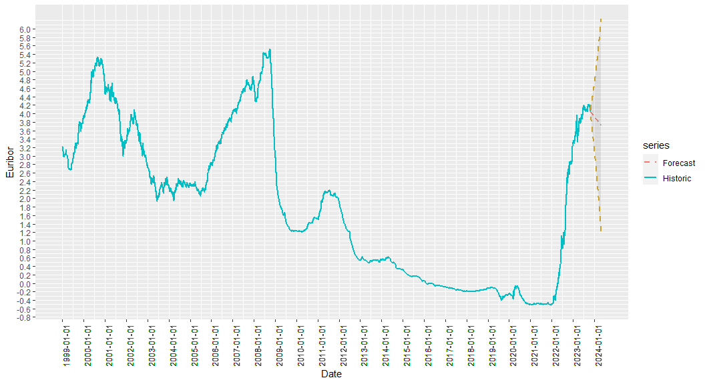
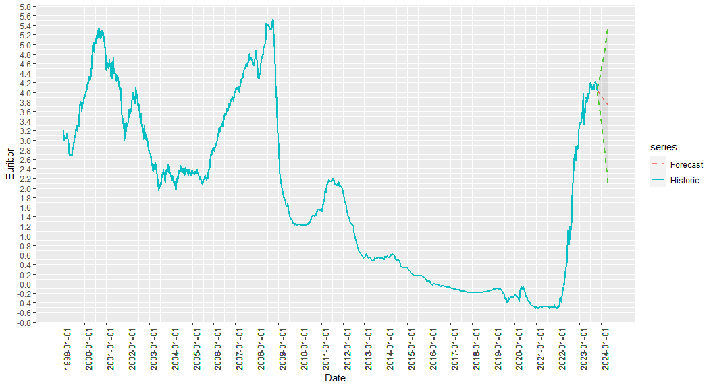

Forecasting EURIBOR 12M with ARIMA using R
================

## Euribor Arima Forecast

Simple R Markdown that pulls historic 12M EURIBOR rates from
<https://www.euribor-rates.eu> in JSON format and performs an ARIMA
(Autoregressive integrated moving average) forecast for the next 180
days.

## Preview Historical Rates Dataset

    ##         date  rate
    ## 1 1999-01-01 3.213
    ## 2 1999-01-04 3.209
    ## 3 1999-01-05 3.187
    ## 4 1999-01-06 3.176
    ## 5 1999-01-07 3.158
    ## 6 1999-01-08 3.139

    ##            date  rate
    ## 6374 2023-10-25 4.118
    ## 6375 2023-10-26 4.128
    ## 6376 2023-10-27 4.104
    ## 6377 2023-10-30 4.078
    ## 6378 2023-10-31 4.052
    ## 6379 2023-11-01 4.044

## Preview Forecast Rates Dataset

    ##         date forecast    lo_80    hi_80    lo_95    hi_95
    ## 1 2023-11-02 4.039480 4.010889 4.068070 3.995755 4.083205
    ## 2 2023-11-03 4.036365 3.993709 4.079021 3.971128 4.101601
    ## 3 2023-11-04 4.033960 3.979091 4.088828 3.950046 4.117874
    ## 4 2023-11-05 4.031900 3.966120 4.097680 3.931298 4.132502
    ## 5 2023-11-06 4.030009 3.954239 4.105779 3.914128 4.145889
    ## 6 2023-11-07 4.028200 3.943120 4.113281 3.898080 4.158321

    ##           date forecast    lo_80    hi_80    lo_95    hi_95
    ## 175 2024-04-24 3.735828 2.154704 5.316951 1.317708 6.153948
    ## 176 2024-04-25 3.734098 2.141796 5.326400 1.298882 6.169314
    ## 177 2024-04-26 3.732369 2.128863 5.335875 1.280018 6.184719
    ## 178 2024-04-27 3.730639 2.115903 5.345375 1.261114 6.200164
    ## 179 2024-04-28 3.728909 2.102919 5.354900 1.242171 6.215647
    ## 180 2024-04-29 3.727180 2.089909 5.364451 1.223190 6.231170

Last historic date is 2023-11-01, forecast range went from 2023-11-02 to
2024-04-29.

## 1 Year Historical + Forecast with 80% & 95% confidence intervals

    ## Warning: Using `size` aesthetic for lines was deprecated in ggplot2 3.4.0.
    ## ℹ Please use `linewidth` instead.

<!-- -->

## All Historic Data + Forecast with 95% confidence interval

<!-- -->

## All Historic Data + Forecast with 80% confidence interval

<!-- -->
